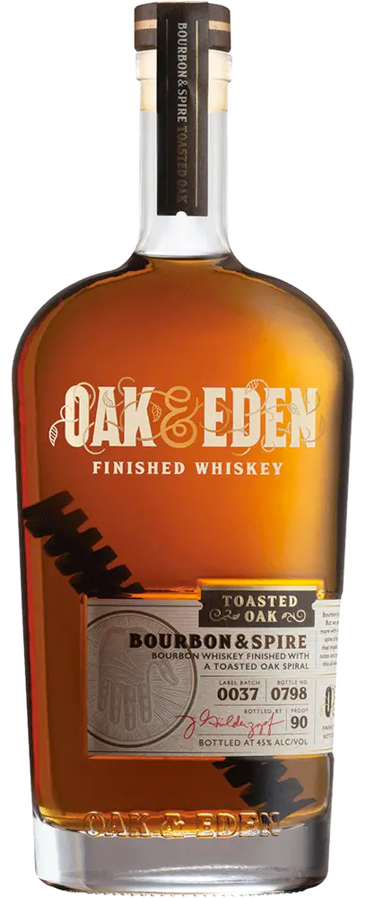
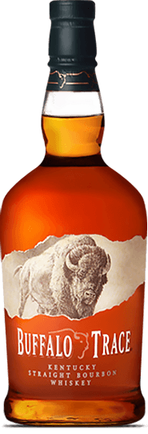
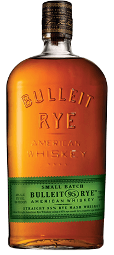
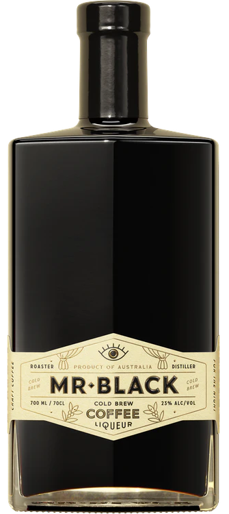
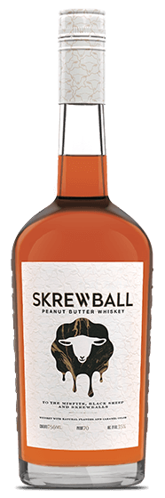
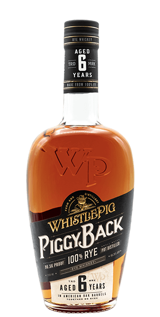

# 🥃 Whiskey

  

A curated list of whiskeys I like. [Learn More](#about-this-project)

<!-- WHISKEY-TABLE:BEGIN -->
| Bottle                                                                                       | Distillery                                   | Location                   | Name                                                                                          | Batch Info (when available)                              | Rating |
|----------------------------------------------------------------------------------------------|----------------------------------------------|----------------------------|-----------------------------------------------------------------------------------------------|----------------------------------------------------------|--------|
| 

  | Oak & Eden                                   | Bridgeport, TX             | [Bourbon & Spire](https://www.oakandeden.com/bourbon)                                         | `Label: 0038, Bottle: 0912`, `Label: 0040, Bottle: 0037` | ★★★★☆  |
| 

                   | Buffalo Trace Distillery                     | Frankfort, KY              | [Buffalo Trace Bourbon](https://www.buffalotracedistillery.com/our-brands/buffalo-trace.html) |                                                          | ★★★★★  |
| 

                  | Bulleit Frontier Whiskey                     | Louisville, KY             | [Bulleit 95 Rye](https://www.bulleit.com/whiskeys/bulleit-rye/)                               |                                                          | ★★★★★  |
| 

                        | Mr. Black Coffee Roasters & Craft Distillers | New South Wales, Australia | [Mr. Black Cold Brew Coffee Liqueur](https://mrblack.co/us/)                                  | `Label: 004/300, Bottle: A1394`                          | ★★★★★  |
| 

 | Skrewball                                    | San Diego, CA              | [Peanut Butter Whiskey](https://www.skrewballwhiskey.com/)                                    |                                                          | ★★★★★  |
| 

    | Whistlepig                                   | Shoreham, VT               | [Piggyback Rye](https://whistlepigwhiskey.com/whiskeys/piggyback-rye/)                        |                                                          | ★★★★★  |
<!-- WHISKEY-TABLE:END -->

_Table dynamically generated with `rake markdown:generate UPDATE_README=1`_

----

## About this project

  

This project is meant as a personal record of whiskeys I like but also a way to experiment with different data formats.

### Available formats

* [JSON](formats/json/whiskey.json) (_master record_)
* [Markdown](README.md) (_this file_)
* [XML](formats/xml/whiskey.xml)
* [YAML](formats/yaml/whiskey.yaml)
* more coming soon.
