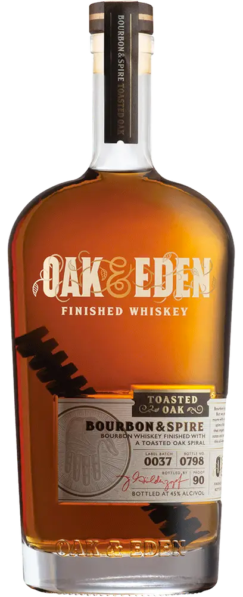

# 🥃  Whiskeys

| Bottle                                                                                     | Distiliary | Name                                                                   | Batch Info                                                                 | Rating |
|--------------------------------------------------------------------------------------------|------------|------------------------------------------------------------------------|----------------------------------------------------------------------------|--------|
| 

 | Oak & Eden | [Bourbon & Spire](https://www.oakandeden.com/bourbon)                  | Label Batch: 0038, Bottle No.: 0912 Label Batch: 0040, Bottle No.: 0037 | ★★★★☆  |
| 

   | Whistlepig | [Piggyback Rye](https://whistlepigwhiskey.com/whiskeys/piggyback-rye/) |                                                                            | ★★★★★  |
